## 图书管理系统开发日志

---

## 一、项目简介

这是一个用C#语言，基于Winform控件的一个可视化界面管理系统

Github项目地址：https://github.com/Utopia-a/Library_Management_System_wjhxsuer（推荐）

Gitee项目地址：https://gitee.com/utopia_w/library-management-system


## 二、项目数据库参考

### 后端数据库（BookDB）表：

```
t_user
属性：
id--varchar
password--varchar
name--varchar
sex--varchar
money--decimal（10，2）

t_admin
属性：
id--varchar
password-varchar

t_book
属性：
id--varchar
name--varchar
author--varchar
press--varchar
stock--int

t_borrow
属性：
no--varchar
uid--varchar
bid--varchar
date--date
rdate--date
fine--decimal（10，2）
```

## 三、功能简介

### 1、用户端：

```
借书 -- 借书前，会进行余额判断，借书书本限制判断，库存判断，已借判断
还书 -- 还书结算金额，借书扣款0.1元，超过30天的部分，每天计0.1元
充值
查看读者卡 -- 读者姓名，性别，用户号，余额，总共借书本书
修改密码 -- 修改密码，自动跳转登录界面功能
查看已借书本
联系管理员
注册信息 -- 将新信息写入数据库
```

### 2、管理员端

```
查看借阅情况
查询读者借阅情况
添加书本
删除书本
查询书本
修改书本
注册信息
```


## 四、界面设计

#### 1、登录界面

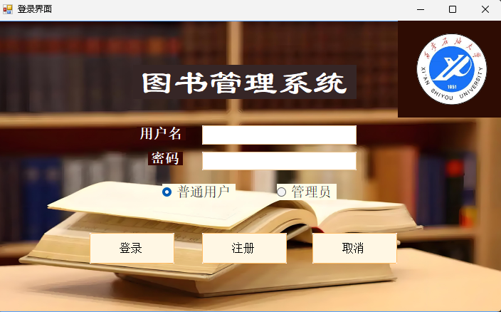

#### 2、用户端

##### （1）首页

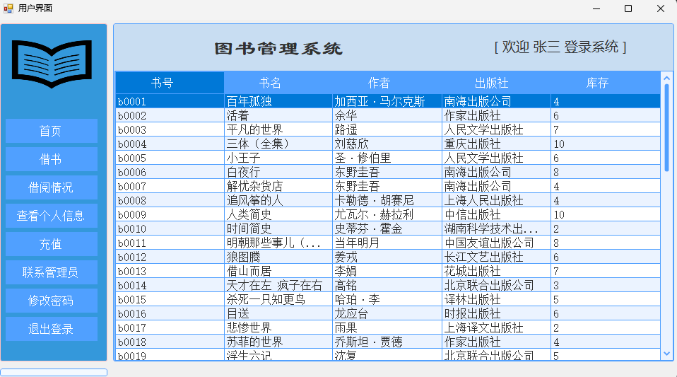

##### （2）借书页面

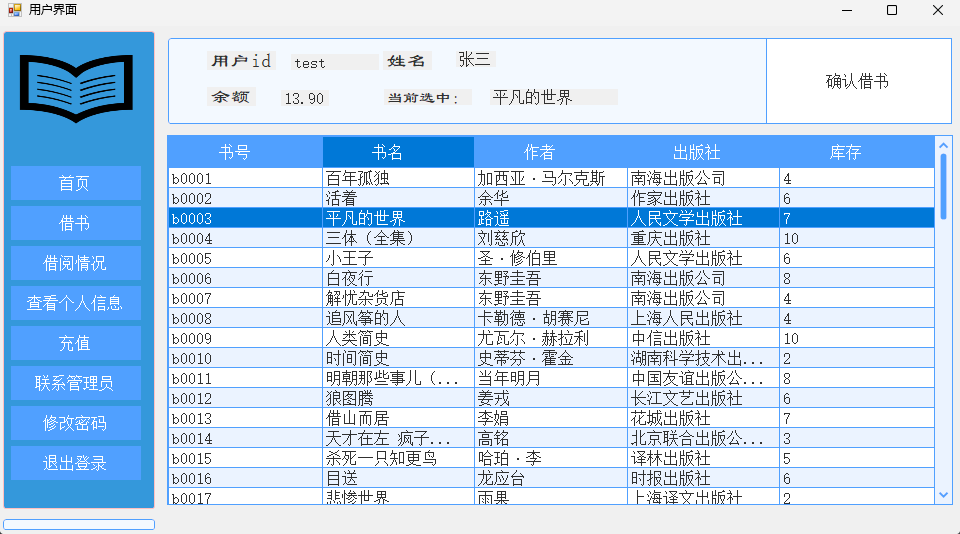

##### （3）查看借阅情况

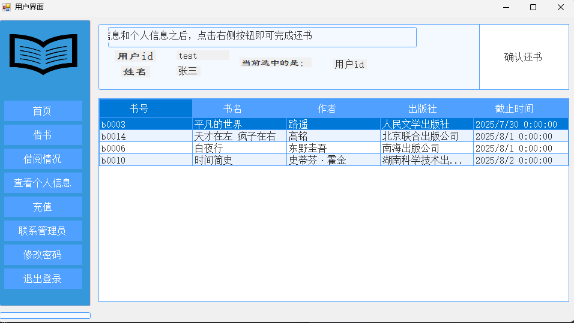

##### （4）查看个人信息

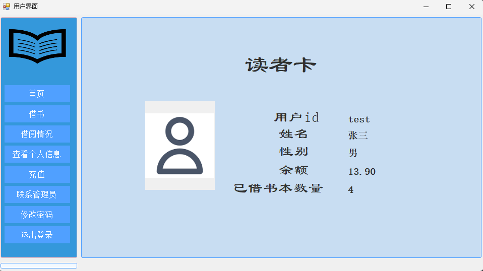

##### （5）充值界面

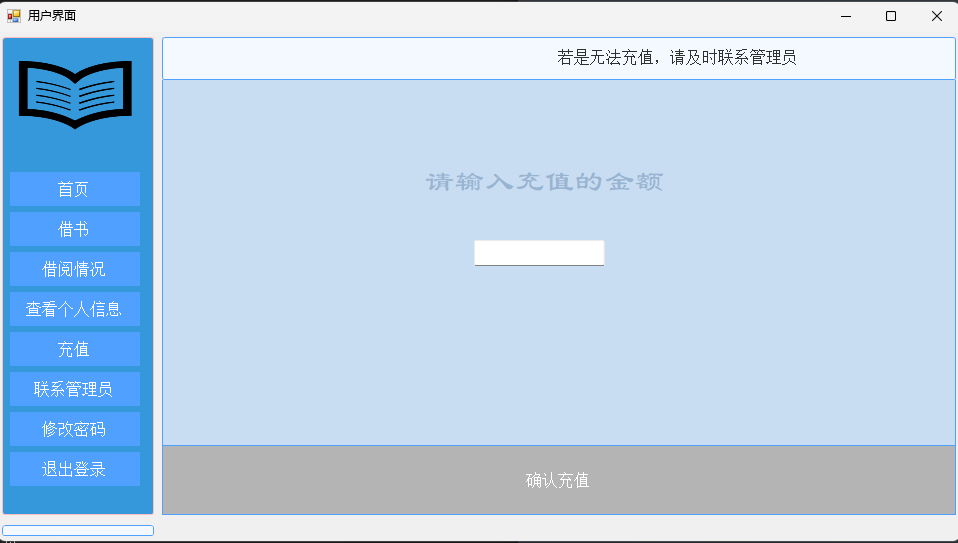

##### （6）联系管理员界面

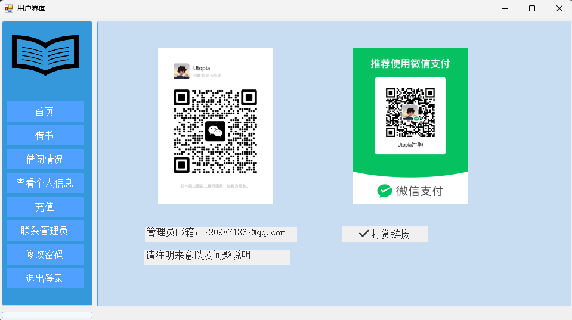

##### （7）修改密码界面

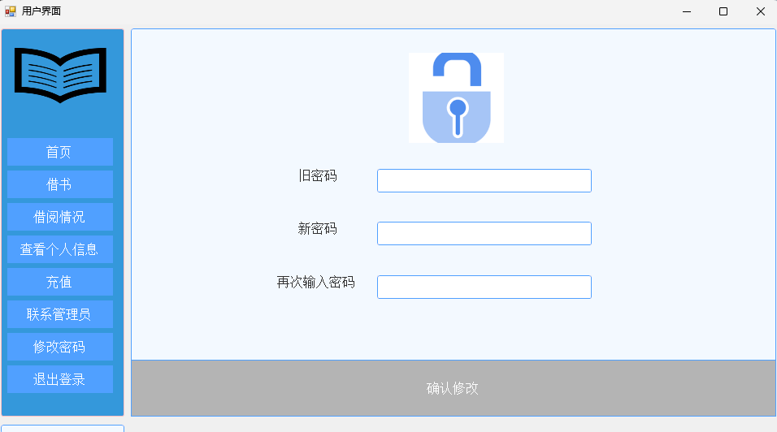


#### 3、管理员界面

##### （1）功能指引界面

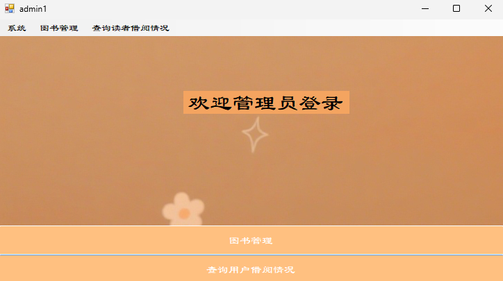

##### （2）增删改查功能界面

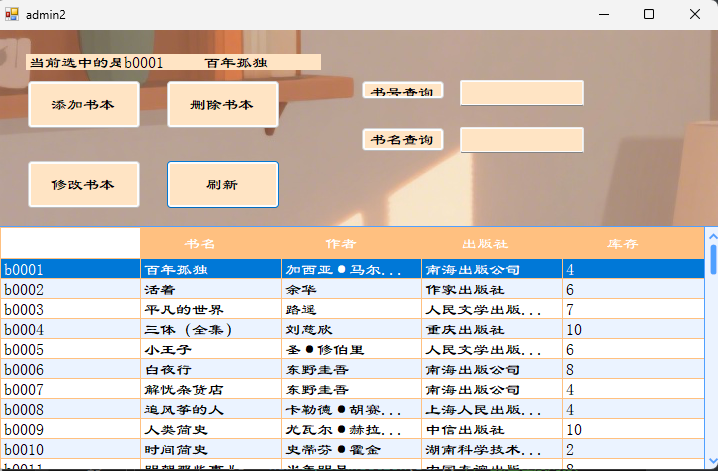

##### （3）查询界面

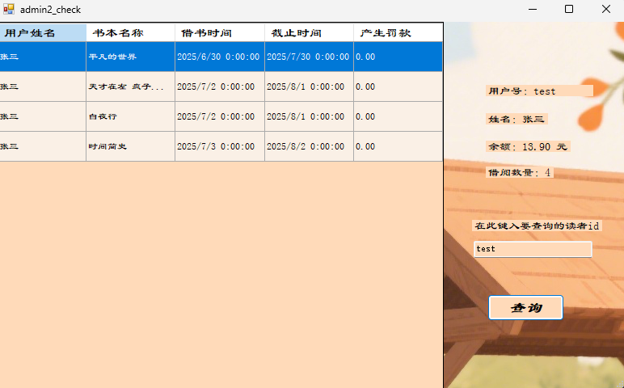


## 五、如何拉取到本地学习

* 更多的可以学习Git相关知识

（1）访问远程仓库，将远程仓库clone至本地仓库

（2）安装SunnyUI和CSkin扩展工具箱，请访问官网，并按照官网教程来安装至项目。

​	* 正确安装之后，在资源管理器中应当出现如下引用

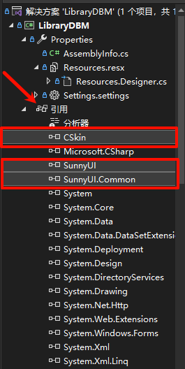

（3）创建数据库，由于作者资金有限，无法上线数据库，请自行参照上文数据库说明，创建相同的数据库。之后在DBconnect文件中将连接数据库的方法中的连接方式改为自己的数据库连接方式，即可正常使用，代码如下，修改注释1处代码块为本地数据库连接方式

```
using System.Data.SqlClient;

namespace LibraryDBM
{
    class DBConnect
    {
        SqlConnection sc;

        // 1. 连接数据库的方法（需要修改的地方）
        public SqlConnection connect()
        {
        //**********修改这句话就行***********
            string str = @"Data Source=数据库引擎; Initial Catalog=数据库名称; Integrated Security=True";
            sc = new SqlConnection(str); // 创建连接对象
                sc.Open(); // 打开数据库连接
                return sc; // 返回连接对象
        }


        // 2. 创建 SQL 命令对象的方法
        public SqlCommand command(string sql)
        {
            SqlCommand cmd = new SqlCommand(sql, connect());
            return cmd;
        }

        // 3. 执行更新类操作的方法（增删改）
        public int Execute(string sql)
        {
            return command(sql).ExecuteNonQuery();
        }

        // 4. 执行读取操作的方法
        public SqlDataReader read(string sql)
        {
            return command(sql).ExecuteReader();
        }

        // 5. 关闭数据库连接的方法
        public void DaoClose()
        {
            sc.Close();
        }
    }
}

```

（4）若是有精力的朋友，可以贡献项目，在远程仓库上发起pr，我会定期维护


## 六、结语

该项目为作者课设作品，也是倾注了许多心血，从零开始学习c#和winform组件，若是该文章对你有帮助的话，还请您动动发财的小手，给项目点个赞，要是可以点点关注的话，嘿嘿，我会很高兴的，后续也会更新一些原创内容与诸君共勉。

